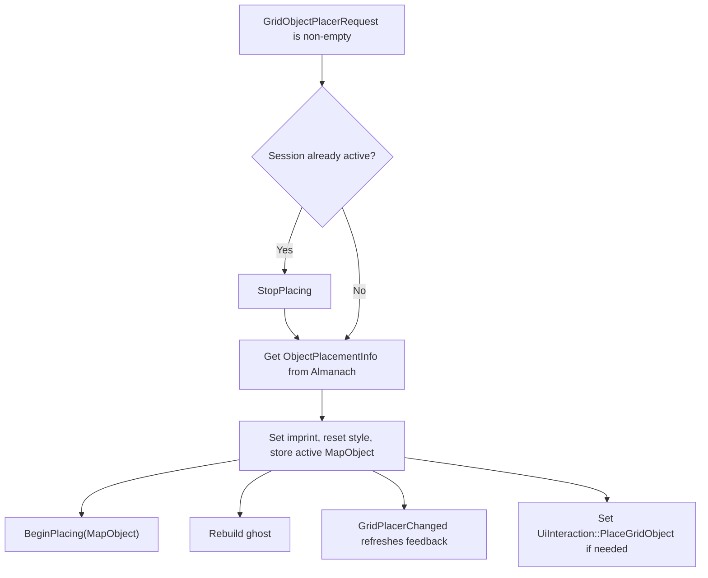
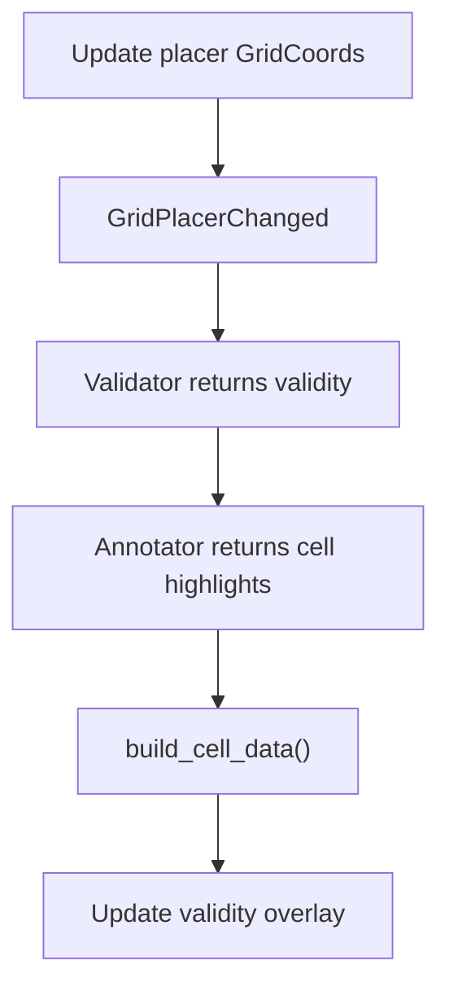
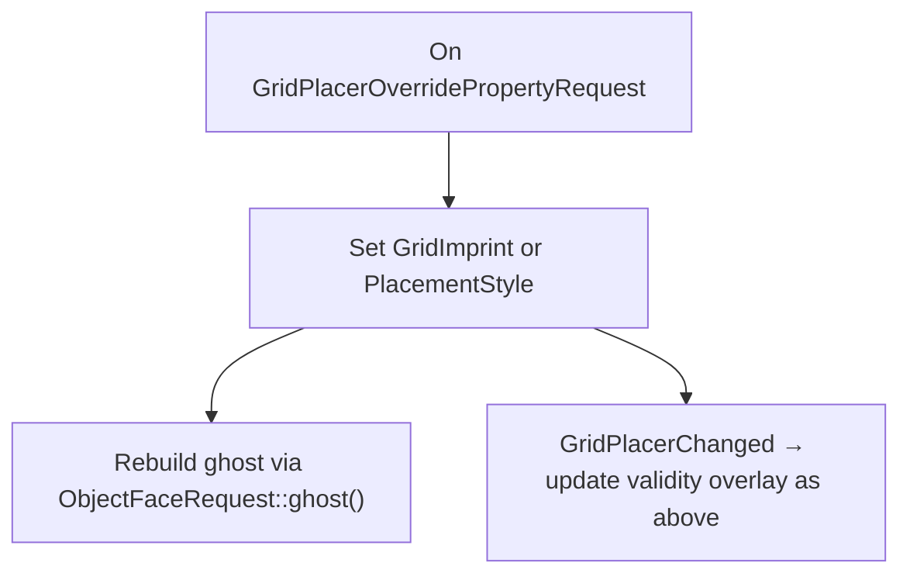
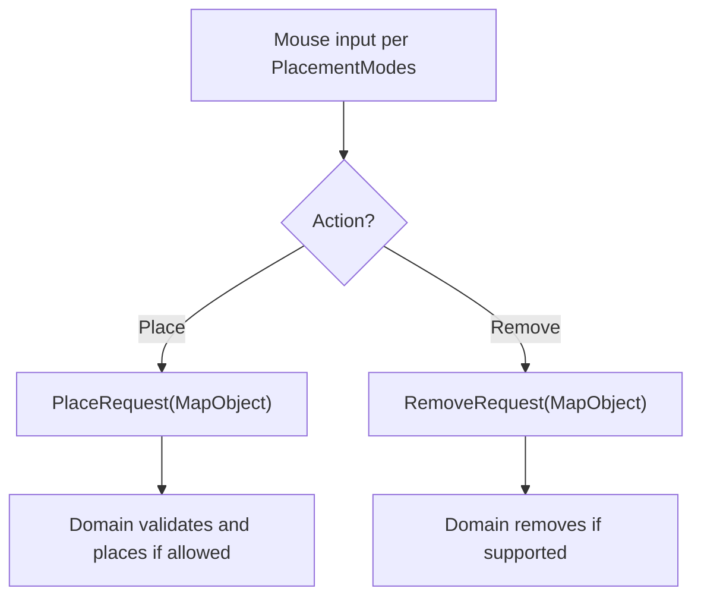
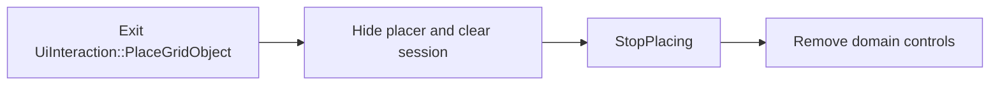

# Grid Object Placer

The grid object placer lets players place and remove objects on the map grid. It follows the cursor, shows a preview and placement feedback, and sends requests when the player clicks.

## How it works

1. **Select:** UI or keyboard input selects a `MapObject`. The placer gets its placement settings from the Almanach and starts a session.
2. **Preview:** The placer follows the cursor. A ghost shows the object; an overlay shows where it can be placed. Domain controls can change its imprint or style.
3. **Act:** A click sends `PlaceRequest` or `RemoveRequest`. The object's domain decides whether to place or remove it.
4. **End:** Switching objects or leaving placement ends the session and removes its controls.

## Integration contracts

### `GridObjectPlacerRequest`

A resource. Set it from UI or keyboard input to start or switch placement:

```rust
grid_object_placer_request.set(MapObject::Wall);
```

### `ObjectPlacementInfo`

Each `MapObject` that can be placed must register its placement info via the app extension. The info is stored in the `Almanach`; the placer retrieves it when starting a new placement session.

```rust
pub struct ObjectPlacementInfo {
    pub imprint: GridImprint,           // Default imprint
    pub validate: PlacementValidatorFn, // Placement validity
    pub annotate: PlacementAnnotatorFn, // Per-cell highlights
    pub placement: PlacementModes,      // Place/remove behavior
}
```

### `PlaceRequest` / `RemoveRequest`

Emitted when the user confirms their intent to place or remove a `MapObject`.

Example of how to handle it:
```rust
// Match to confirm it is your domain
let PlaceRequest(MapObject::Wall) = *trigger else { return };
// Access placer data
let (coords, imprint, style) = placer.into_inner();
// Perform all domain validations
if (almanach.walls.validate)(MapObject::Wall, *coords, *imprint, &grids) == PlacementValidity::Invalid { return; }
// Finally, perform the placement or removal in your domain
commands.spawn(BuilderWall::new(*coords, *style));
```

### `BeginPlacing` / `StopPlacing`

Emitted at the beginning and end of a placement session. Use them to create and clean up any domain-specific configurators, like a style picker for walls or a size picker for quantum fields.

```rust
let BeginPlacing(MapObject::Wall) = *trigger else { return };
commands.spawn(GridPlacerUiForWall);
```

### `GridPlacerOverridePropertyRequest`

A set of overrides for the currently active placement session. Mostly used by domain-specific configurators, like overriding `GridImprint` when using a quantum-field size selector.

```rust
commands.trigger(GridPlacerOverridePropertyRequest::OverrideStyle(selected.0));
```

Available overrides:
- `OverrideImprint(GridImprint)` — set new imprint shape.
- `OverrideStyle(u32)` — set domain-defined style.

### `ObjectFaceRequest`

The placer emits it when it needs to repaint the ghost. The domain must observe it if it wants to provide a custom ghost look. This is a generic repaint event; see `ObjectFaceRequest`.
### `GridPlacerChanged`

Emitted whenever the state of the placer changes, including on a grid-cell change when following the mouse.

## Flows

### Starting a session



### While the session is active

**Cursor moves to another grid cell**



**Imprint or style override**



**Mouse input**



For deferred spawns, `ReservedCoords` prevents another placement from using the same cells before the obstacle grid updates. Reservations clear at the start of the next frame.

**Leaving placement**



## Adding a placeable object

1. Add its variant to `MapObject` (`game_core/src/types.rs`).
2. Register placement settings via `AlmanachAppExt`, convert the domain info to `ObjectPlacementInfo`, and extend `Almanach::get_placement_info_for`.
3. Observe `PlaceRequest` and, if supported, `RemoveRequest`; match the variant and validate before acting.
4. Handle `ObjectFaceRequest` for the ghost and any other supported surfaces.
5. If needed, add controls for `BeginPlacing` / `StopPlacing` and send imprint or style overrides.
6. Add side-menu presentation through `Almanach::presentation_for` and the appropriate menu offering, if the object is offered there.

Placement types: `grids/src/placement.rs`. Placer implementation: `grids_internal/src/placement.rs`.
